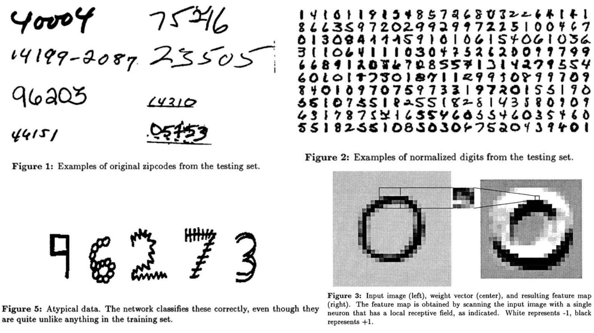
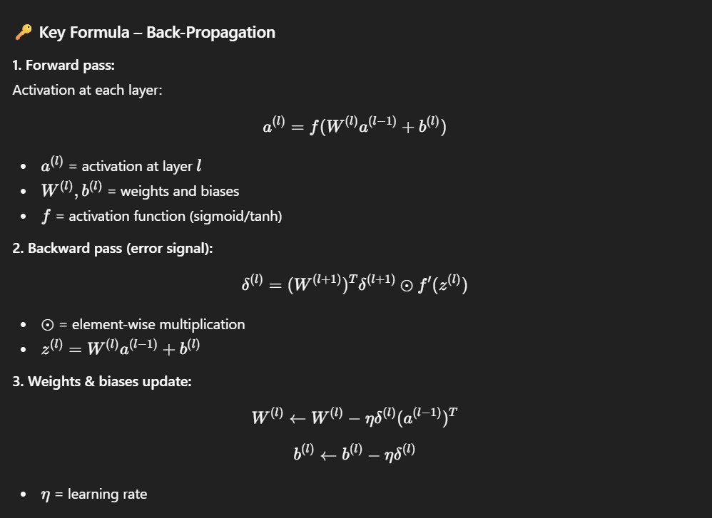

# ✏️ Handwritten Digit Recognition – Back-Propagation Network

Replication of **“Handwritten Digit Recognition with a Back-Propagation Network”** (LeCun et al., 1989, AT&T Bell Labs). This project reproduces the network and methodology with minimal preprocessing to classify handwritten digits (0–9).

**Paper:** [Handwritten Digit Recognition with a Back-Propagation Network](https://proceedings.neurips.cc/paper_files/paper/1989/file/53c3bce66e43be4f209556518c2fcb54-Paper.pdf)

---

## 🖼 Overview – Model & Dataset

  
This project implements a **fully connected back-propagation network** for handwritten digit recognition.

- **Input:** 16×16 pixel grayscale images from the USPS dataset, normalized to `[-1, 1]`.  
- **Architecture:** Input layer → Hidden layers → Output layer with 10 neurons (digits 0–9).  
- **Purpose:** Learn a mapping from image pixels to digit classes using **gradient descent and back-propagation**.  
- **Highlights:** Minimal preprocessing, constrained architecture, faithful replication of the original LeCun et al. design.

---

## 🧮 Key Mathematical Idea

  

>This figure summarizes the core learning mechanism of the network: how errors are propagated backward to update weights and biases, enabling the network to map input pixels to digit classes efficiently.

---

## 🏗️ Model Architecture

```bash
HandwrittenDigitRecognition-BP-PaperReplicating/
│
├── data/
│   ├── train/
│   ├── test/
│   └── usps.h5
│
├── dataproc/
│   ├── preprocess.py
│   └── preview.py
│
├── models/
│   ├── bp_network.py
│   └── layers.py
│
├── utils/
│   ├── dataset.py
│   ├── metrics.py
│   └── visualization.py
│
├── images/
│   ├── figmix.jpg       # Model & dataset overview
│   └── math.jpg         # Key equations & backprop math
│
├── requirements.txt
└── README.md

```
---
## 🔗 Feedback

For feedback or questions, contact: [barkin.adiguzel@gmail.com](mailto:barkin.adiguzel@gmail.com)
